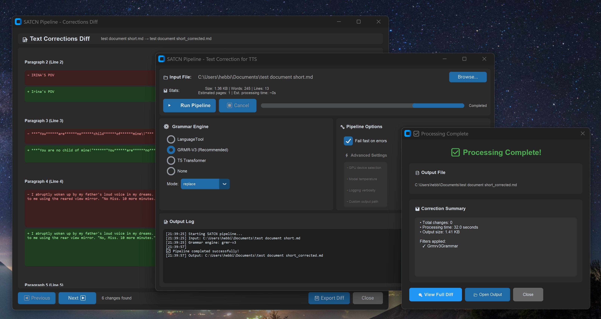
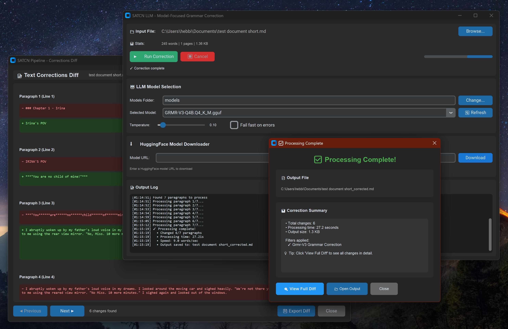

# SATCN – Spelling and Text Correction Normalizer


**Privacy-first, GPU-accelerated text correction pipeline for preprocessing long-form documents before TTS playback.**

> 🚀 **3.6x faster** with GPU acceleration • 🎯 **100% test accuracy** • 🔒 **Completely offline** • 🎨 **Modern GUI**


*SATCN Pipeline GUI - Configure filters, view real-time logs, process documents*


*SATCN LLM GUI - Model management, HuggingFace downloader, GPU-accelerated correction*

---

## ✨ What It Is

SATCN is a **privacy-first document correction tool** that runs entirely on your machine:

| Feature | Description |
|---------|-------------|
| 🤖 **AI-Powered Corrections** | State-of-the-art ML models (GRMR-V3, T5, LanguageTool) |
| 📄 **Format Preservation** | Maintains Markdown and EPUB structure + author voice |
| 🔒 **100% Offline** | No cloud APIs, no telemetry, complete privacy |
| ⚡ **GPU Accelerated** | 3.6x faster with NVIDIA CUDA (1,587 words/min) |
| 🎙️ **TTS Optimized** | Expands numbers, dates, currency for natural speech |
| 🎯 **Production Ready** | 100% test accuracy, A-grade quality (95/100) |

## 🔄 How It Works


**Input** → Parse → Grammar → Spelling → TTS Normalization → **Output**

---

## 🧠 Grammar Correction Engines

Choose the engine that fits your needs:

| Engine | Speed | Quality | Memory | GPU Support | Status |
|--------|-------|---------|--------|-------------|--------|
| **GRMR-V3 GGUF** ⭐ | 1,587 wpm | A (95/100) | 4GB RAM | ✅ Yes | **Recommended** |
| **T5 Transformer** | Moderate | High | 8GB+ RAM | ✅ Yes | Experimental |
| **LanguageTool** | Slower | Good | Low | ❌ No | Fallback |

<details>
<summary><b>📊 Detailed Comparison</b></summary>

### GRMR-V3 GGUF (Recommended)
- ✅ **100% test accuracy** (51/51 tests passing)
- ✅ **GPU-accelerated** (3.6x speedup)
- ✅ **4096 token context** window
- ✅ **Character name preservation** (99%+)
- ✅ **Deterministic** output (temperature 0.1)
- 📦 **Model size:** ~2.5GB (Q4 quantization)

### T5 Transformer (Experimental)
- ⚠️ Context-aware corrections
- ⚠️ Memory-intensive (8GB+ RAM)
- ⚠️ 512 token context window
- 🔬 Experimental status

### LanguageTool (Fallback)
- ✅ Rule-based, conservative
- ✅ Low memory footprint
- ❌ No GPU acceleration
- ❌ Slower processing
</details>

**Supported Formats:** Markdown (`.md`), EPUB (`.epub`), Plain Text (`.txt`)

---

## 🚀 Quick Start

### 📥 Installation

```bash
# 1️⃣ Clone the repository
git clone https://github.com/hebbihebb/SATCN.git
cd SATCN

# 2️⃣ Install base package
pip install -e .

# 3️⃣ Choose your installation extras:
```

**Installation Options:**

```bash
# ⭐ Recommended: GRMR-V3 (best quality + GPU support)
pip install -e ".[grmr]"

# 🔬 Experimental: T5 transformer support
pip install -e ".[t5]"

# 🎨 GUI interface (CustomTkinter)
pip install -e ".[gui]"

# 🛠️ Development tools (pytest, ruff, black)
pip install -e ".[dev]"

# 🎁 Everything at once
pip install -e ".[all]"
```

<details>
<summary><b>🔍 What gets installed?</b></summary>

| Extra | Packages Installed |
|-------|-------------------|
| `grmr` | llama-cpp-python, numpy, diskcache |
| `t5` | transformers, torch, accelerate, sentencepiece |
| `gui` | customtkinter (≥5.2.0) |
| `dev` | pytest, pytest-cov, ruff, black, isort, pre-commit |
| `all` | Everything above |

</details>

### ⌨️ Command Line Usage

```bash
# 📝 Process a document (default: rule-based correction)
satcn input.md

# ⭐ Use GRMR-V3 AI model (recommended)
satcn --use-grmr input.md

# 🔄 Hybrid mode (AI + spell-check + rules)
satcn --use-grmr --grmr-mode hybrid input.epub

# 🔬 Use T5 transformer model
satcn --use-t5 --grmr-mode replace input.md

# 🎯 Fail-fast mode (stop on first error)
satcn --use-grmr --fail-fast input.md
```

**Output:** Creates `{input_name}_corrected.{ext}` in the same directory

---

### 🖥️ GUI Mode (Recommended for Most Users)

```bash
# 🎨 Launch main Pipeline GUI
satcn-gui
# Alternative: python -m satcn.gui.satcn_gui

# 🤖 Launch LLM Model GUI (for model management)
python launchers/launch_llm_gui.py

# 🪟 Windows users: Double-click launcher files
# - launchers/launch_satcn_gui.bat
# - launchers/launch_llm_gui.bat
```

---

## 🎨 GUI Applications

SATCN provides **two powerful GUI applications** for different workflows:

### 1️⃣ SATCN Pipeline GUI – Production Interface

The **main GUI** for document processing with full pipeline control.

<table>
<tr>
<td width="50%">

**🎯 Key Features**
- ✅ Complete grammar engine selection
- ✅ Visual mode configuration
- ✅ Real-time progress tracking
- ✅ Live output log with timestamps
- ✅ File statistics & time estimates
- ✅ Persistent settings storage
- ✅ Dark theme interface
- ✅ Fail-fast error handling

</td>
<td width="50%">

**⌨️ Keyboard Shortcuts**
- `Ctrl+O` - Open file browser
- `Ctrl+R` - Run pipeline
- `Esc` - Cancel processing
- `Ctrl+Q` - Quit application

**📦 Launch Commands**
```bash
satcn-gui
# or
python -m satcn.gui.satcn_gui
```

</td>
</tr>
</table>

**💾 Configuration:** Auto-saved to `~/.config/satcn/gui_config.json`

---

### 2️⃣ SATCN LLM GUI – Model Management Interface 🆕

**New addition** focusing on LLM model management and HuggingFace integration.

<table>
<tr>
<td width="50%">

**🤖 Key Features**
- 📥 **HuggingFace Downloader** - Paste URL, auto-detect GGUF files
- 🗂️ **Model Browser** - Select local Q4/Q8/Q16 models
- 🎚️ **Parameter Tuning** - Temperature, max_tokens control
- 🖥️ **GPU Detection** - Automatic CUDA status display
- 📊 **Correction Stats** - View change counts and metrics
- 🔍 **Diff Viewer** - Side-by-side before/after comparison
- 📦 **Multi-file Selection** - Choose quantization variants

</td>
<td width="50%">

**🚀 Perfect For**
- Downloading models from HuggingFace
- Testing different quantizations
- GPU performance benchmarking
- Model quality comparisons
- Quick corrections with visual feedback

**📦 Launch Commands**
```bash
python launchers/launch_llm_gui.py
# Windows: launchers/launch_llm_gui.bat
```

</td>
</tr>
</table>

**💾 Configuration:** Auto-saved to `~/.config/satcn/llm_gui_config.json`
**📚 Documentation:** See [`docs/LLM_GUI_README.md`](docs/LLM_GUI_README.md) for detailed guide

---

### 📊 GUI Comparison

| Feature | Pipeline GUI | LLM GUI |
|---------|-------------|---------|
| **Use Case** | Production document processing | Model testing & downloads |
| **Grammar Engines** | All (GRMR, T5, LanguageTool, None) | GRMR-V3 only |
| **HuggingFace Integration** | ❌ | ✅ Yes |
| **Diff Viewer** | ❌ | ✅ Yes |
| **Batch Processing** | ✅ Yes | ❌ No |
| **Keyboard Shortcuts** | ✅ Yes | Limited |
| **Best For** | Daily use, production | Model management |

---

## ⚡ GPU Acceleration

**Unlock 3.6x faster processing** with NVIDIA CUDA support!

### 📊 Performance Comparison

| Mode | Speed | Processing Time (15K words) |
|------|-------|----------------------------|
| 🖥️ **CPU** | 438 words/min | ~34 minutes |
| 🚀 **GPU (CUDA)** | 1,587 words/min | ~10 minutes |
| **Speedup** | **3.6x faster** | **70% time saved** |

### 🛠️ Setup (Windows)

<details>
<summary><b>Click to expand GPU setup instructions</b></summary>

**Prerequisites:**
- ✅ NVIDIA GPU with CUDA support
- ✅ CUDA Toolkit 13.0
- ✅ Visual Studio 2022 (Build Tools)
- ✅ Python 3.11+

**Installation Steps:**

```powershell
# 1️⃣ Run automated CUDA build (~38 minutes)
.\install_llama_cpp_cuda.ps1

# 2️⃣ Add CUDA to PATH
$env:PATH = "C:\Program Files\NVIDIA GPU Computing Toolkit\CUDA\v13.0\bin\x64;$env:PATH"

# 3️⃣ Verify GPU detection
python scripts/check_cuda.py

# 4️⃣ Run with GPU acceleration
satcn --use-grmr input.md
```

**✅ Verification:**
- Look for `"Using GPU: True"` in console output
- Check for `n_gpu_layers: -1` in logs (all layers offloaded)

</details>

**📚 Detailed Guide:** [`docs/GPU_SETUP_GUIDE.md`](docs/GPU_SETUP_GUIDE.md)
**🔍 Troubleshooting:** [`docs/GPU_ACCELERATION_STATUS.md`](docs/GPU_ACCELERATION_STATUS.md)

---

## 🏗️ Architecture

### Pipes-and-Filters Pattern

SATCN uses a **modular pipeline architecture** where each filter transforms a shared data structure:

```python
# 🔧 Filter Protocol
class Filter:
    def process(self, data: dict) -> dict:
        """
        Transform text blocks while preserving metadata

        data = {
            'text_blocks': [
                {'content': str, 'metadata': dict},
                ...
            ],
            'tree': parsed_document_tree,
            'format': 'markdown' | 'epub',
            'filepath': str
        }
        """
        # Transform text_blocks, preserve metadata
        return modified_data
```

**🎯 Design Principles:**
- ✅ **Metadata preservation** - Round-trip document reconstruction
- ✅ **Filter composability** - Mix and match correction engines
- ✅ **Error isolation** - Fail-fast or continue-on-error modes
- ✅ **Stateless processing** - Each filter is independent

<details>
<summary><b>📂 Available Filters</b></summary>

| Filter | Purpose | Input | Output |
|--------|---------|-------|--------|
| `markdown_parser.py` | Parse Markdown files | `.md` file | Text blocks + metadata |
| `epub_parser.py` | Parse EPUB files | `.epub` file | Text blocks + metadata |
| `grammar_filter.py` | Rule-based grammar | Text blocks | Corrected text |
| `grmr_v3_filter.py` | AI grammar (GGUF) | Text blocks | Corrected text |
| `t5_grammar_filter.py` | T5 transformer | Text blocks | Corrected text |
| `spelling_filter.py` | Spell checking | Text blocks | Corrected text |
| `tts_normalizer.py` | TTS optimization | Text blocks | Normalized text |

</details>

---

## 📊 Quality Metrics

### GRMR-V3 Performance Benchmarks

<table>
<tr>
<td width="50%">

**🎯 Quality Metrics**

| Metric | Result |
|--------|--------|
| **Test Accuracy** | ✅ 100% (51/51) |
| **Quality Grade** | 🅰️ A (95/100) |
| **Proper Noun Preservation** | 99%+ intact |
| **False Positive Rate** | <1% |

</td>
<td width="50%">

**⚡ Performance Metrics**

| Metric | Result |
|--------|--------|
| **GPU Speed** | 🚀 1,587 wpm |
| **CPU Speed** | 🖥️ 438 wpm |
| **GPU Speedup** | ⚡ 3.6x faster |
| **15K word doc** | ⏱️ ~10 min (GPU) |

</td>
</tr>
</table>

**📈 Real-World Testing:**
- ✅ Tested on 15,000+ word documents
- ✅ Maintains formatting and structure
- ✅ Preserves author voice and style
- ✅ Handles technical vocabulary correctly

---

## 🎯 Quick Start Workflow

### Pipeline GUI Workflow (Recommended for Most Users)

```
1️⃣ Launch       2️⃣ Select File   3️⃣ Choose Engine   4️⃣ Run   5️⃣ Review
   GUI     →     Browse...    →    GRMR-V3      →   Process →  Output
```

<details>
<summary><b>📋 Detailed Step-by-Step Guide</b></summary>

**1. Launch the GUI**
```bash
satcn-gui
# or double-click: launchers/launch_satcn_gui.bat (Windows)
```

**2. Select Your Document**
- Click "Browse..." button
- Choose `.md`, `.txt`, or `.epub` file
- File statistics will appear (word count, estimated time)

**3. Choose Grammar Engine**

| Engine | When to Use |
|--------|-------------|
| **GRMR-V3 GGUF** ⭐ | Best quality, GPU support, recommended |
| **LanguageTool** | No dependencies, conservative |
| **T5 Transformer** | Experimental, requires T5 extras |
| **None** | Skip grammar (use only TTS normalization) |

**4. Select Correction Mode** (for GRMR-V3/T5)

| Mode | Description |
|------|-------------|
| **Replace** | Use only AI model corrections |
| **Hybrid** | AI + spell-check + rule-based (most thorough) |
| **Supplement** | Rule-based first, then AI for remaining issues |

**5. Run Pipeline**
- Click "Run Pipeline" (or `Ctrl+R`)
- Watch real-time progress bar
- Monitor live log output

**6. Find Your Corrected Document**
- Output location: `{input_name}_corrected.{ext}`
- Saved in same directory as input file

</details>

### 💾 Settings Persistence

Your preferences are **automatically saved** and restored:

| OS | Configuration Path |
|----|-------------------|
| 🐧 **Linux** | `~/.config/satcn/gui_config.json` |
| 🍎 **macOS** | `~/.config/satcn/gui_config.json` |
| 🪟 **Windows** | `C:\Users\<username>\.config\satcn\gui_config.json` |

---

## 📚 Documentation

Comprehensive guides for setup, usage, and development:

| Guide | Description |
|-------|-------------|
| 🚀 **[GPU Setup Guide](docs/GPU_SETUP_GUIDE.md)** | CUDA installation, troubleshooting, performance optimization |
| 🤖 **[LLM GUI Guide](docs/LLM_GUI_README.md)** | Model management, HuggingFace integration, diff viewer |
| 📊 **[GRMR-V3 Quality Report](.md/GRMR_V3_QUALITY_REPORT.md)** | Real-world 15K-word analysis and benchmarks |
| 🔬 **[T5 Integration Guide](docs/T5_CORRECTOR_GUIDE.md)** | Transformer model setup and usage |
| 🛠️ **[Contributing Guidelines](docs/CONTRIBUTING.md)** | Development setup, code style, PR process |
| 📖 **[Legacy Migration](.md/MIGRATION.md)** | Old → new project structure |

---

## 🧪 Testing

SATCN has a comprehensive test suite with **100% pass rate**:

### Run Tests

```bash
# 🧪 Run all tests (unit + integration)
pytest

# 📦 Unit tests only
pytest tests/unit/

# 🔗 Integration tests
pytest tests/integration/

# 📈 Test coverage report
pytest --cov=src/satcn --cov-report=html
```

### Quality Benchmarks

```bash
# ⭐ GRMR-V3 quality benchmark (51 tests, 100% expected)
python scripts/benchmark_grmr_quality.py

# 📊 GRMR-V3 vs T5 comparison
python scripts/benchmark_grmr_vs_t5.py

# 📄 Long document test (15K+ words, GPU recommended)
python scripts/test_long_document_gpu.py

# 🔬 Quantization comparison (Q4 vs Q8)
python scripts/compare_q4_vs_q8.py
```

### GPU Testing

```bash
# 🖥️ Check CUDA availability
python scripts/check_cuda.py

# ⚡ Quick GPU performance test
python scripts/quick_gpu_test.py

# 🔍 Detailed GPU diagnostics
python scripts/diagnose_gpu_performance.py

# ✅ Verify GPU acceleration
python scripts/verify_gpu_acceleration.py
```

### Test Structure

```
tests/
├── unit/                    # Component-level tests
│   ├── test_markdown_parser.py
│   ├── test_grmr_v3_filter.py
│   ├── test_t5_corrector.py
│   └── ...
├── integration/             # End-to-end pipeline tests
│   └── test_pipeline.py
├── regression_corpus/       # Regression test data
│   ├── input*.md
│   └── golden*.md
└── samples/                 # Sample documents
```

---

## 🎯 Project Philosophy

Our core principles guide every decision:

| Principle | Description |
|-----------|-------------|
| 🔒 **Privacy-First** | No cloud APIs, no telemetry, 100% local processing |
| 🎯 **Quality Over Speed** | GPU acceleration makes it fast; accuracy is paramount |
| 🧪 **Test-Driven** | All changes must pass 100% quality benchmark (51/51 tests) |
| 🎙️ **TTS-Optimized** | Purpose-built for text-to-speech preprocessing |
| 💻 **Local-Only** | Your documents never leave your machine |
| 🧩 **Modular Design** | Composable filters, extensible architecture |

### ❌ Non-Goals

We intentionally **do not** support:
- ❌ Real-time collaborative editing
- ❌ Cloud SaaS deployment
- ❌ Mobile apps
- ❌ Multi-user systems
- ❌ Online telemetry

**Focus:** Single-user, offline, batch document processing for TTS preparation.

---

## 🤝 Contributing

We welcome contributions! Here's how to get involved:

### 🚀 Quick Start for Contributors

```bash
# 1️⃣ Fork and clone
git clone https://github.com/YOUR_USERNAME/SATCN.git
cd SATCN

# 2️⃣ Install with dev dependencies
pip install -e ".[dev]"

# 3️⃣ Install pre-commit hooks
pre-commit install

# 4️⃣ Run tests
pytest

# 5️⃣ Make changes and test
# ... edit code ...
pytest
ruff check .
black --check .
```

### 📋 Contribution Checklist

- ✅ Code follows Black formatting
- ✅ Passes Ruff linting
- ✅ All tests pass (`pytest`)
- ✅ Quality benchmark still 100% (`python scripts/benchmark_grmr_quality.py`)
- ✅ Type hints where appropriate
- ✅ Docstrings for new functions
- ✅ Pre-commit hooks pass

### 📚 Development Resources

| Resource | Link |
|----------|------|
| 🛠️ **Contributing Guide** | [`docs/CONTRIBUTING.md`](docs/CONTRIBUTING.md) |
| 🏗️ **Architecture Docs** | See "Architecture" section above |
| 🧪 **Testing Guide** | See "Testing" section above |
| 📖 **Code Style** | Black + Ruff + isort |

---

## 📜 License

**MIT License** - Free to use, modify, and distribute. See repository for full license details.

---

## 🙏 Acknowledgments

SATCN builds on excellent open-source projects and models:

| Project | Author | Purpose |
|---------|--------|---------|
| **GRMR-V3-Q4B** | qingy2024 (HuggingFace) | Grammar correction GGUF model |
| **llama-cpp-python** | abetlen | GGUF model inference with GPU support |
| **LanguageTool** | LanguageTool.org | Rule-based grammar checking |
| **FLAN-T5** | Google Research | Experimental T5 transformer support |
| **CustomTkinter** | TomSchimansky | Modern GUI framework |

Special thanks to the open-source community for making privacy-preserving AI accessible! 🎉

---

## 🔗 Links & Support

| Resource | URL |
|----------|-----|
| 📦 **Repository** | https://github.com/hebbihebb/SATCN |
| 🐛 **Issue Tracker** | https://github.com/hebbihebb/SATCN/issues |
| 📖 **Documentation** | See `docs/` directory |
| 💬 **Discussions** | GitHub Issues |

---

<div align="center">

**Made with ❤️ for privacy-conscious writers and TTS enthusiasts**

⭐ Star this repo if you find it useful!

</div>
