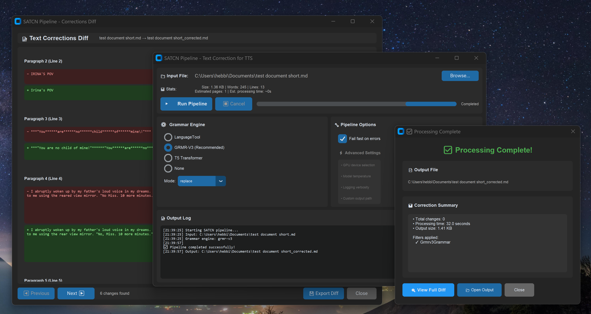

# SATCN – Spelling and Text Correction Normalizer


**Local-only text correction pipeline for preprocessing long-form documents before TTS playback.**


*SATCN Pipeline GUI - Configure filters, view real-time logs, process documents*

## What It Is

SATCN is a privacy-first document correction tool that:
- **Fixes grammar, spelling, and punctuation** using state-of-the-art ML models
- **Preserves formatting** (Markdown, EPUB) and author voice
- **Runs entirely offline** - no cloud APIs, full privacy
- **Supports GPU acceleration** - 3.6x faster with CUDA
- **Optimizes for TTS** - expands numbers, dates, currency for natural speech

## What It Does

```
Input Document  →  Parse  →  [Correction Filters]  →  TTS Normalize  →  Clean Output
```

**3 Grammar Correction Options:**
1. **GRMR-V3 GGUF** ⭐ (Recommended) - Quantized AI model, 100% test accuracy, GPU-ready
2. **T5 Transformer** (Experimental) - Context-aware but memory-intensive
3. **LanguageTool** (Fallback) - Rule-based, conservative

**Supported Formats:** Markdown (`.md`), EPUB (`.epub`)

## Quick Start

### Installation

```bash
# Clone repository
git clone https://github.com/hebbihebb/SATCN.git
cd SATCN

# Install package (editable mode recommended for development)
pip install -e .

# Optional: Install GRMR-V3 (recommended for best quality)
pip install -e ".[grmr]"

# Optional: Install T5 transformer support
pip install -e ".[t5]"

# Optional: Install all features + dev tools
pip install -e ".[all]"
```

### Basic Usage

```bash
# Process a document (default: rule-based correction)
satcn input.md

# Use GRMR-V3 AI model (recommended)
satcn --use-grmr input.md

# Hybrid mode (AI + spell-check + rules)
satcn --use-grmr --grmr-mode hybrid input.epub

# GUI mode
python -m satcn.gui.pipeline_test_gui
```

### GPU Acceleration (Optional)

For 3.6x speedup on NVIDIA GPUs:

```bash
# Prerequisites: CUDA 13.0, Visual Studio 2022, Python 3.11
# Run automated CUDA build (~38 minutes)
.\install_llama_cpp_cuda.ps1

# Add CUDA to PATH
$env:PATH = "C:\Program Files\NVIDIA GPU Computing Toolkit\CUDA\v13.0\bin\x64;$env:PATH"

# Process with GPU
satcn --use-grmr input.md
```

See [`docs/GPU_SETUP_GUIDE.md`](docs/GPU_SETUP_GUIDE.md) for detailed GPU setup.

## How It Works

### Architecture: Pipes-and-Filters Pattern

Each filter transforms a shared `data` dictionary containing `text_blocks`:

```python
# Filter protocol
class Filter:
    def process(self, data: dict) -> dict:
        """
        data = {
            'text_blocks': [{'content': str, 'metadata': dict}, ...],
            'tree': parsed_document_tree,
            'format': 'markdown' | 'epub',
            'filepath': str
        }
        """
        # Transform text_blocks, preserve metadata
        return modified_data
```

**Critical:** Metadata must be preserved for round-trip document reconstruction.

### Quality Metrics (GRMR-V3)

| Metric | Result |
|--------|--------|
| **Test Accuracy** | 100% (51/51 tests) |
| **Quality Grade** | A (95/100) |
| **Character Preservation** | 99%+ (proper nouns intact) |
| **Speed (GPU)** | 1,587 words/minute |
| **Speed (CPU)** | 438 words/minute |

## Documentation

- **[GPU Setup Guide](docs/GPU_SETUP_GUIDE.md)** - CUDA installation, troubleshooting
- **[GRMR-V3 Quality Report](GRMR_V3_QUALITY_REPORT.md)** - Real-world 15K-word analysis
- **[T5 Integration Guide](docs/T5_CORRECTOR_GUIDE.md)** - Transformer model usage
- **[Contributing Guidelines](CONTRIBUTING.md)** - Development setup

## Testing

```bash
# Run all tests
pytest

# Unit tests only
pytest tests/unit/

# Quality benchmark (100% pass rate expected)
python scripts/benchmark_grmr_quality.py

# Long document test (15K+ words, GPU recommended)
python scripts/test_long_document_gpu.py
```

## Project Philosophy

1. **Privacy-first** - Never add cloud APIs or telemetry
2. **Quality over speed** - GPU makes it fast enough, accuracy comes first
3. **Test-driven** - Changes require passing 100% quality benchmark
4. **TTS-optimized** - Designed for text-to-speech preprocessing
5. **Local-only** - All processing happens on your machine

**Not a goal:** Real-time editing, cloud SaaS, multi-user collaboration, mobile apps

## Contributing

Contributions welcome! See [`CONTRIBUTING.md`](CONTRIBUTING.md) for:
- Development setup
- Code style (Black, Ruff, isort)
- Testing requirements
- Pull request process

## License

MIT License - see [LICENSE](LICENSE) for details.

## Acknowledgments

- **GRMR-V3-Q4B** by qingy2024 (Hugging Face)
- **FLAN-T5** by Google (experimental support)
- **LanguageTool** for rule-based grammar checking

---

**Repository:** https://github.com/hebbihebb/SATCN  
**Issues:** https://github.com/hebbihebb/SATCN/issues
